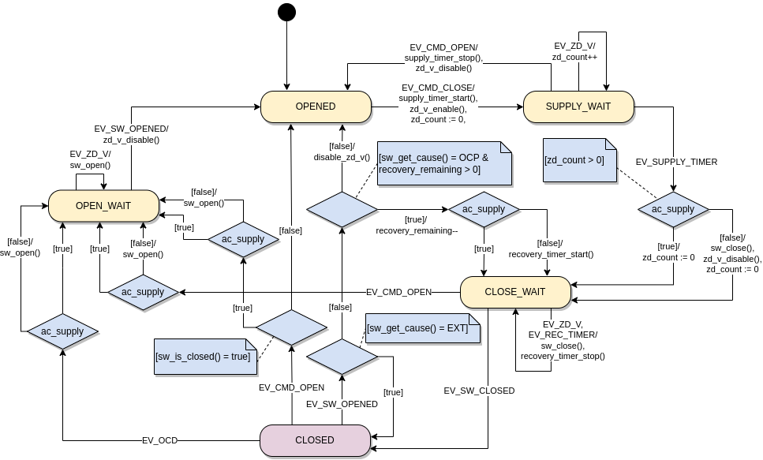
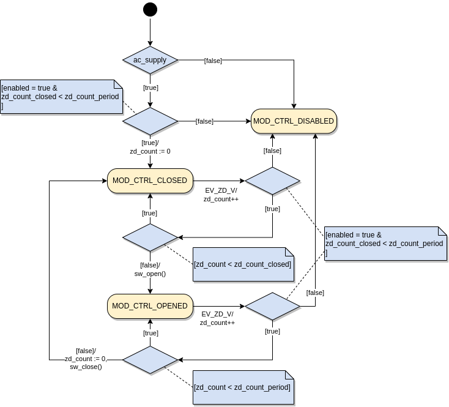

# Default Trip Curve

## Main State Machine
The following figure shows the main state machine (MSM) for the default trip curve.
MSM models the operational behaviour of the trip curve rather than the status of the switch (opened or closed).

### States

| State | Description |
| :--- | :--- |
| `OPENED` | MSM wait until it receives the event `EV_CMD_CLOSE`. Note that the switch is also opened in this state. |
| `SUPPLY_WAIT` | MSM waits until the type of the power supply is detected (AC or DC).  |
| `CLOSE_WAIT` | MSM waits until it receives either of the events `EV_SW_CLOSED` or `EV_CMD_OPEN`. |
| `CLOSED` | This state is similar to a composite state having multiple nested state machines. Refer to the [closed-state operation mode](#closed-state-operation-mode) for more details. |
| `OPEN_WAIT` | MSM waits until it receives the event `EV_SW_OPENED`. |

### Events

| Event | Description |
| :--- | :--- |
| `EV_CMD_OPEN` | User requests to open the switch permanently. |
| `EV_CMD_CLOSE` | User requests to close the switch permanently. |
| `EV_ZD_V` | Voltage zero crossing happened (for AC supplies). |
| `EV_OCD` | Overcurrent situation detected from the programmed trip curve. |
| `EV_SW_CLOSED` | The switch changed its state to "closed". |
| `EV_SW_OPENED` | The switch changed its state to "opened". |
| `EV_SUPPLY_TIMER` | The supply voltage detection timer expired. |
| `EV_REC_TIMER` | The recovery timer expired. |

### Functions

| Function | Description |
| :--- | :--- |
| `supply_timer_start()` | Start supply detection timer. |
| `supply_timer_stop()` | Stop supply detection timer. |
| `sw_close()` | Close the switch. |
| `sw_open()` | Open the switch. |
| `sw_is_closed()` | Returns true if the switch is already closed. |
| `sw_get_cause()` | Get the cause of changing the switch state. |
| `recovery_timer_start()` | Start recovery timer. |
| `recovery_timer_stop()` | Stop recovery timer. |
| `zd_v_enable()` | Enable zero-cross detection for voltage. |
| `zd_v_disable()` | Disable zero-cross detection for voltage. |

### Variables

| Variable | Description |
| :--- | :--- |
| `zd_count` | Number of zero-crossing detections. |
| `recovery_remaining` | Number of times remaining for recovery operation.  |

## Closed-state Operation Mode

The closed-state operation mode describes the operation of the switch when the MSM is in the `CLOSED` state. For example, the switch could be open and close at the zero-crossing of the voltage to perform sine wave modulation.

## Modulation Control State Machine

### Variables

| Variable | Description |
| :--- | :--- |
| `enabled` | Set to true if the modulation control is enabled. |
| `zd_count_closed` | Number of zero-detections that the switch should stay closed |
| `zd_count_period` | Total number of zero-detections in period. |